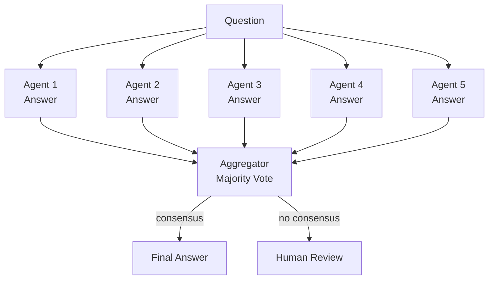

# Consensus Voting Pattern

N independent agents each produce an answer without seeing each other's work. A aggregator picks the majority answer or flags disagreement for human review.

## When to Use
- High-stakes answers where confidence matters
- Reducing hallucination risk on factual questions
- Classification tasks needing reliability
- When a single agent's output is not trustworthy enough alone
