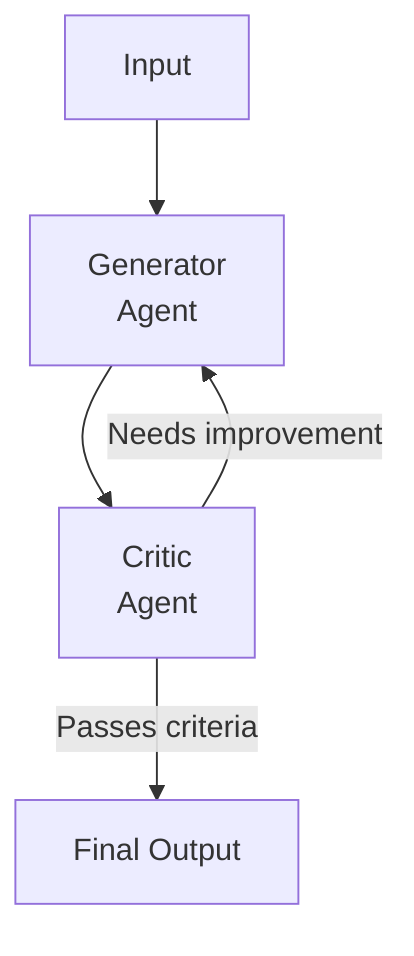

# Critic-Refiner Pattern

A generator agent produces output, a critic evaluates it against criteria, and the generator refines based on feedback. Loops until quality threshold is met.

## When to Use
- Code generation that must meet quality standards
- Writing that needs iterative improvement
- Any output where "good enough on first try" is unlikely
- When you can define clear acceptance criteria for the critic
