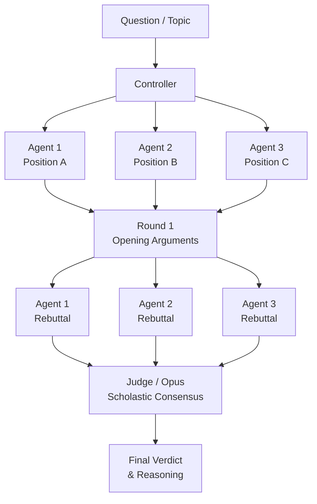
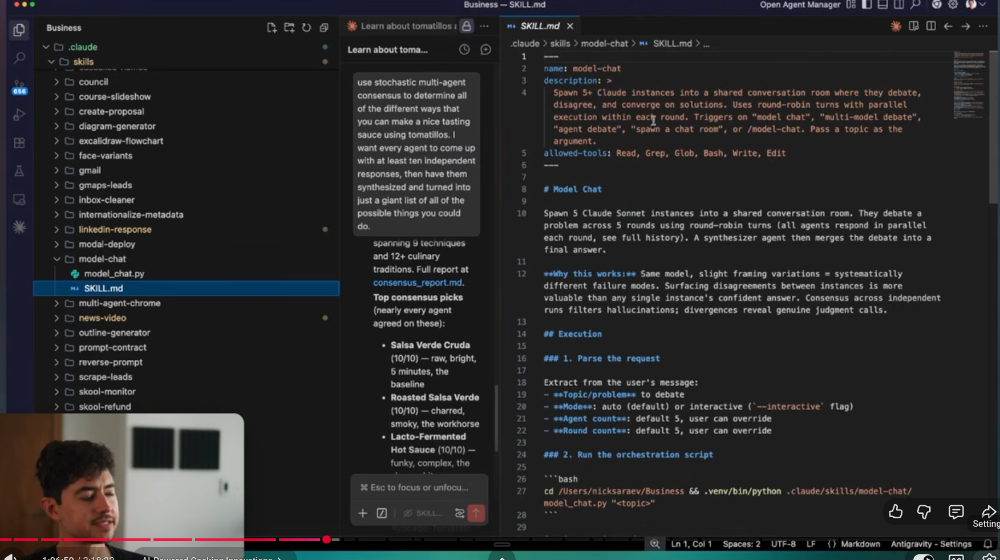

# Debate Pattern for Scholastic Consensus

A multi-agent pattern where N agents argue opposing or distinct positions on a topic, challenge each other's reasoning, and a judge agent evaluates the full debate to reach a well-reasoned consensus.

## How It Works

1. **Controller** defines the question and assigns each agent a distinct position/perspective
2. **Round 1 (Opening)** — each agent independently argues its position
3. **Round 2 (Rebuttal)** — each agent reads the others' arguments and challenges them
4. **Judge** reads the full transcript and delivers a reasoned verdict or synthesis

Agents are adversarial by design — this surfaces blind spots that a single agent would miss.



## Model Split

| Role | Model | Why |
|---|---|---|
| Debaters | Sonnet | Fast argumentation, cost-effective per round |
| Judge | Opus | Needs to weigh complex, conflicting reasoning |

## Example Prompt

```
Use a debate pattern to evaluate: "Is X the right approach for Y?"
Spin 3 agents — one advocate, one critic, one devil's advocate.
Run 2 rounds (opening + rebuttal), then have Opus judge the debate
and deliver a scholastic consensus with supporting reasoning.
```

## When to Use

- Architecture or design decisions with real trade-offs
- Evaluating competing tools, frameworks, or strategies
- Any question where groupthink is a risk
- When you need a defensible, well-reasoned conclusion — not just an answer


## skill?

