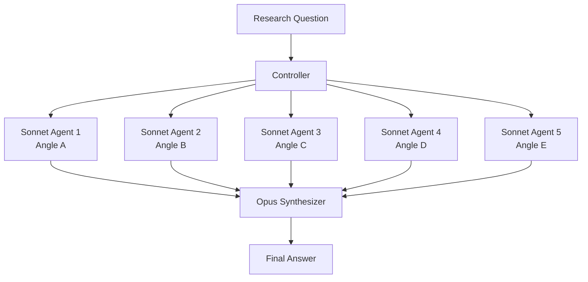

# Fan-Out / Fan-In Pattern

A multi-agent research pattern where a controller splits a question into N independent sub-topics, dispatches parallel agents to research each one, then feeds all findings to a single synthesizer agent that produces a unified answer.

## How It Works

1. **Controller** breaks the topic into N independent research angles
2. **Fan-out** — N Sonnet agents run in parallel, each focused on one angle
3. **Fan-in** — Opus receives all N reports and synthesizes a final answer

Each researcher has no knowledge of the others. The synthesizer sees everything.



## Model Split

| Role | Model | Why |
|---|---|---|
| Researcher | Sonnet | Fast, cost-effective, good for focused tasks |
| Synthesizer | Opus | Deep reasoning across multiple inputs |

## Example Prompt

```
use a fan-out-fan-in (N-researched -> synthesizer) approach to research the topic : "how to ....?" 
spin minimum of 5 subagents, use sonnet to do the research and individual contemplation, opus to synthesize.
```

## When to Use

- Research questions with multiple independent dimensions
- Comparing approaches/tools/frameworks across several axes
- Any task where parallel exploration beats sequential thinking
