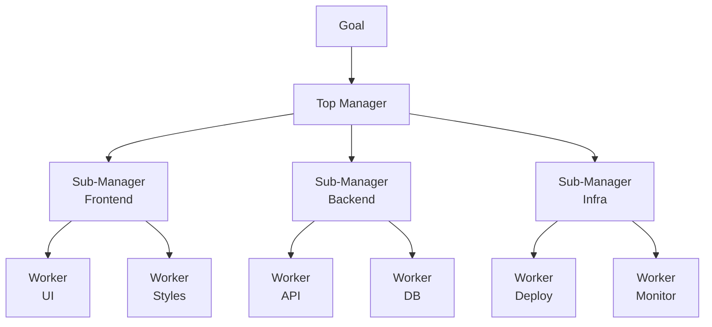

# Hierarchical Pattern

A tree of agents where a top-level manager delegates to sub-managers, who each delegate to workers. Each layer handles coordination for its own subtree.

## When to Use
- Very large tasks that overwhelm a single orchestrator
- Projects with distinct domains that each have their own subtasks
- When sub-managers need autonomy within their domain
- Simulating team structures (PM → Tech Lead → Engineer)
