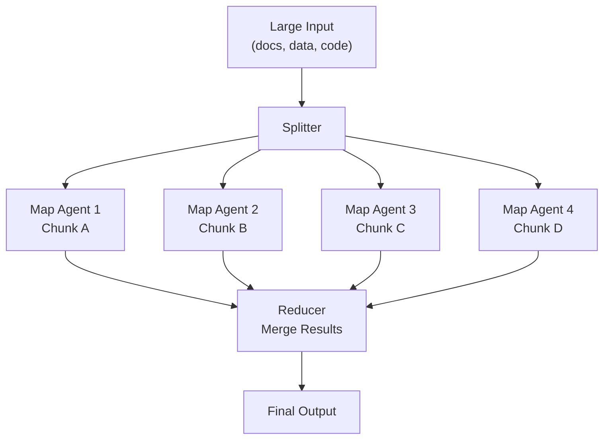

# Map-Reduce Pattern

A large input is split into chunks and mapped to N parallel agents, each processing one chunk. A reducer merges all partial results into a final output.

## When to Use
- Analyzing documents too large for one context window
- Bulk processing (summarize 100 articles, classify 1000 items)
- Codebase-wide analysis across many files
- Any task that can be split into identical independent units
