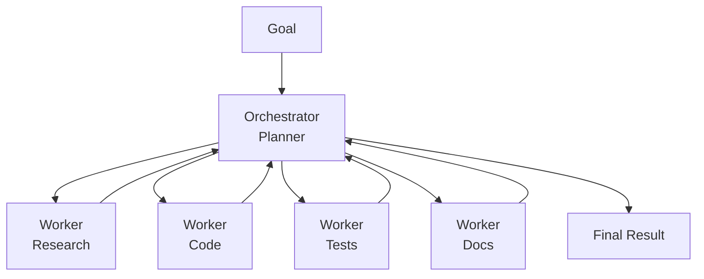

# Orchestrator-Worker Pattern

One planner agent breaks down a complex goal into tasks and delegates each to a specialized worker agent. Workers report back; orchestrator assembles the result.

## When to Use
- Complex projects with clearly distinct subtasks
- When workers need specialized context/tools
- Tasks too large for a single agent's context window
- Any project-style work with multiple parallel deliverables
