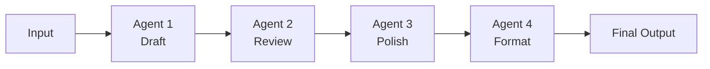

# Pipeline Pattern

A sequential chain where each agent's output becomes the next agent's input. Each stage has a single responsibility and transforms the work forward.

## When to Use
- Multi-stage content creation (draft → review → edit → publish)
- Data transformation with distinct processing steps
- Tasks where each stage requires different expertise
- When order matters and each step depends on the previous
