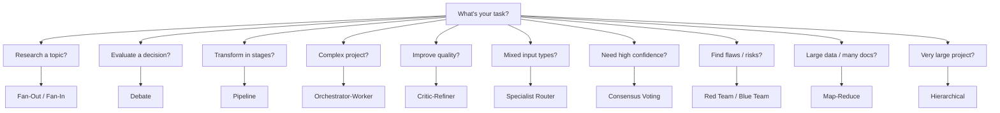

# Multi-Agent Patterns

A collection of parallel and multi-agent design patterns for Claude. Each pattern is a different way to structure agent collaboration.

## Patterns

| Pattern | File | Structure | Best For |
|---|---|---|---|
| Fan-Out / Fan-In | [fanInFanOut.md](./fanInFanOut.md) | N researchers → synthesizer | Broad research across many angles |
| Debate | [debate.md](./debate.md) | N adversarial agents → judge | Decisions with real trade-offs |
| Pipeline | [pipeline.md](./pipeline.md) | A → B → C (sequential) | Multi-stage transformations |
| Orchestrator-Worker | [orchestrator-worker.md](./orchestrator-worker.md) | Planner → specialized workers | Complex projects with distinct subtasks |
| Critic-Refiner | [critic-refiner.md](./critic-refiner.md) | Generator ↔ Critic (loop) | Iterative quality improvement |
| Specialist Router | [specialist-router.md](./specialist-router.md) | Router → domain expert | Mixed queries needing different expertise |
| Consensus Voting | [consensus-voting.md](./consensus-voting.md) | N independent answers → vote | High-stakes answers needing confidence |
| Red Team / Blue Team | [red-team-blue-team.md](./red-team-blue-team.md) | Attacker vs Defender → arbiter | Security review, stress-testing |
| Map-Reduce | [map-reduce.md](./map-reduce.md) | Split → N parallel → merge | Large inputs, bulk processing |
| Hierarchical | [hierarchical.md](./hierarchical.md) | Manager → sub-managers → workers | Very large tasks, team simulation |

## Choosing a Pattern

## Model Guidelines

- **Sonnet** — default for all worker/researcher agents (fast, cost-effective)
- **Opus** — use for synthesizers, judges, and orchestrators (deep reasoning)
- **Haiku** — use for simple routing, classification, or high-volume map steps
