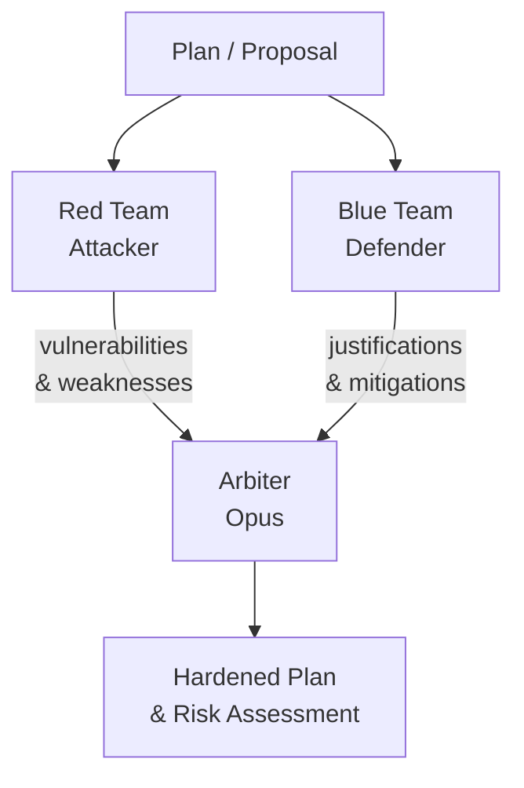

# Red Team / Blue Team Pattern

Two adversarial agents with opposite goals — one attacks/finds flaws, one defends/justifies. An arbiter evaluates both and produces a hardened conclusion.

## When to Use
- Security review of architectures or code
- Stress-testing business plans or strategies
- Identifying edge cases before shipping
- When you want to find problems before users do
