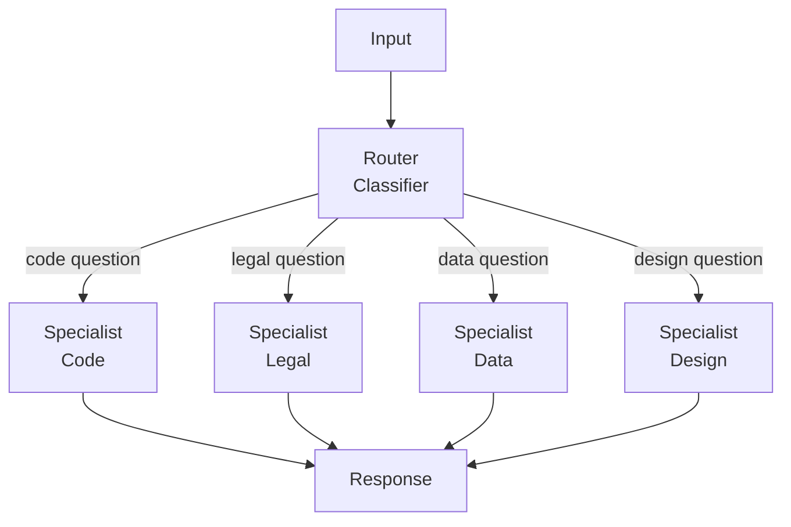

# Specialist Router Pattern

A router agent classifies incoming input and dispatches it to the most appropriate specialist agent. Each specialist handles only its domain.

## When to Use
- Mixed-domain query systems (chatbots, assistants)
- When different input types need very different handling
- To keep specialist agents small and focused
- When routing logic is simpler than a general agent handling all cases
