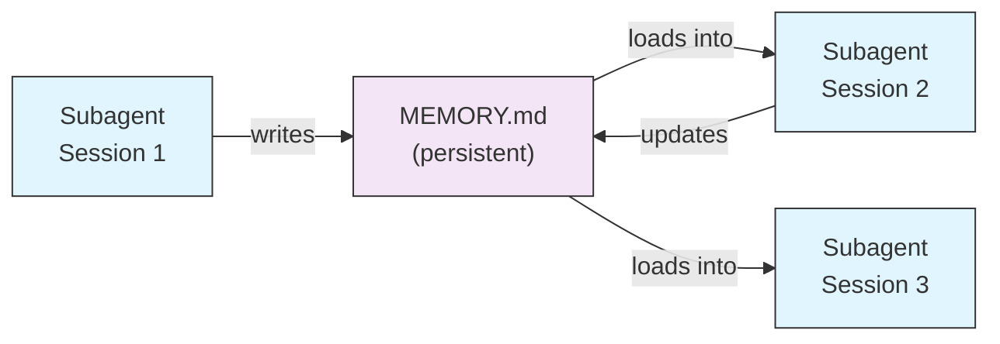

# Memory for Subagents

The `memory` field gives subagents a persistent directory that survives across conversations. This allows subagents to build up knowledge over time, storing notes, findings, and context that persist between sessions.

### Memory Scopes

| Scope | Directory | Use Case |
|-------|-----------|----------|
| `user` | `~/.claude/agent-memory/<name>/` | Personal notes and preferences across all projects |
| `project` | `.claude/agent-memory/<name>/` | Project-specific knowledge shared with the team |
| `local` | `.claude/agent-memory-local/<name>/` | Local project knowledge not committed to version control |

### How It Works

- The first 200 lines of `MEMORY.md` in the memory directory are automatically loaded into the subagent's system prompt
- The `Read`, `Write`, and `Edit` tools are automatically enabled for the subagent to manage its memory files
- The subagent can create additional files in its memory directory as needed

