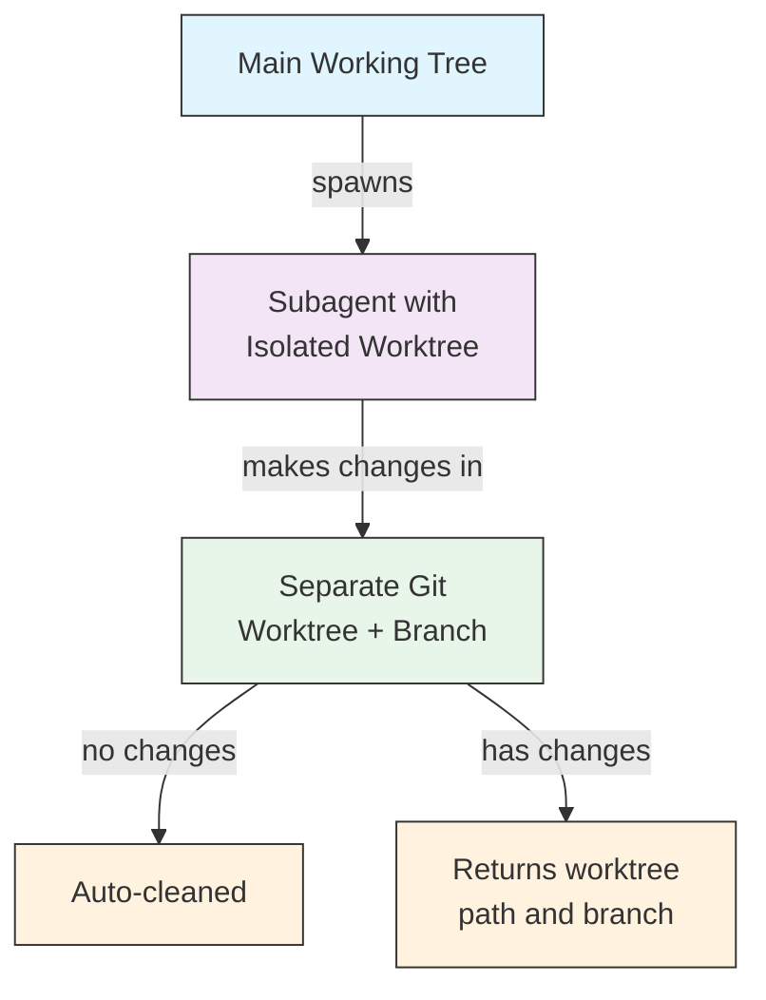

## Worktree Isolation

The `isolation: worktree` setting gives a subagent its own git worktree, allowing it to make changes independently without affecting the main working tree.

### Configuration

```yaml
---
name: feature-builder
isolation: worktree
description: Implements features in an isolated git worktree
tools: Read, Write, Edit, Bash, Grep, Glob
---
```

### How It Works



- The subagent operates in its own git worktree on a separate branch
- If the subagent makes no changes, the worktree is automatically cleaned up
- If changes exist, the worktree path and branch name are returned to the main agent for review or merging

---