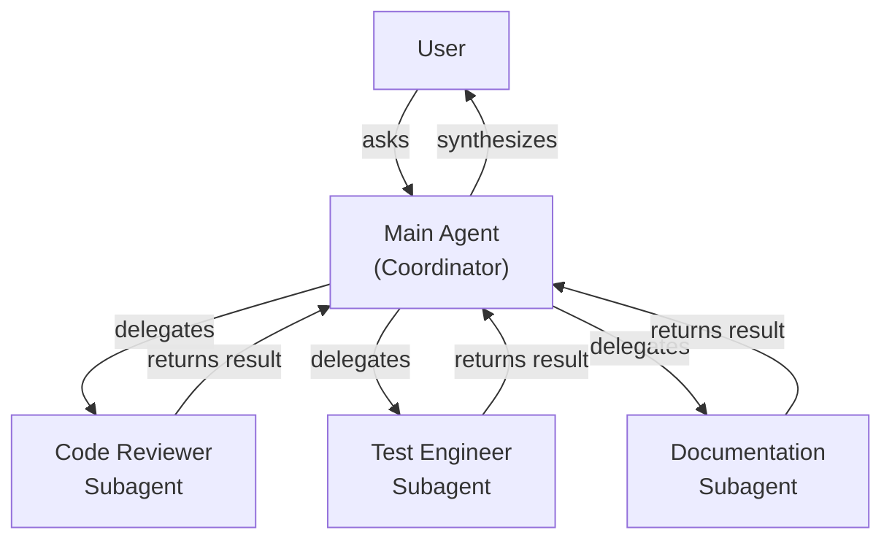
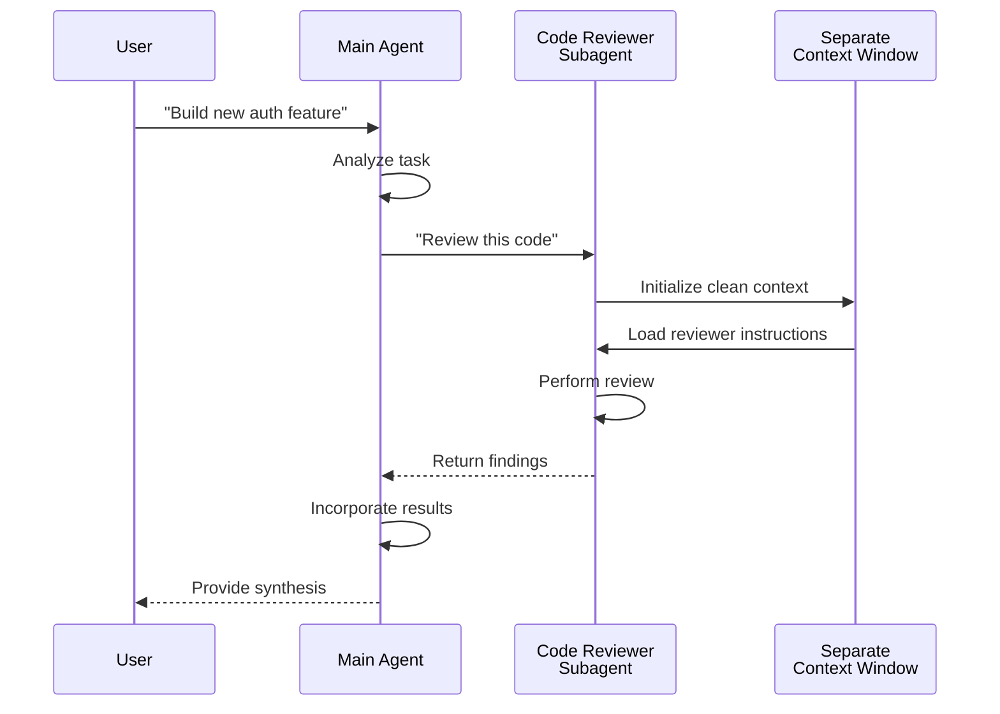
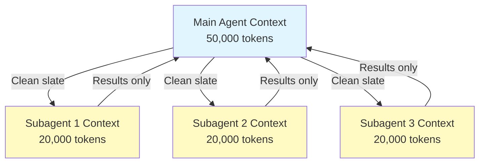

## High-Level Architecture

### Subagent Lifecycle

---

## Context Management

### Key Points

- Each subagent gets a **fresh context window** without the main conversation history
- Only the **relevant context** is passed to the subagent for their specific task
- Results are **distilled** back to the main agent
- This prevents **context token exhaustion** on long projects