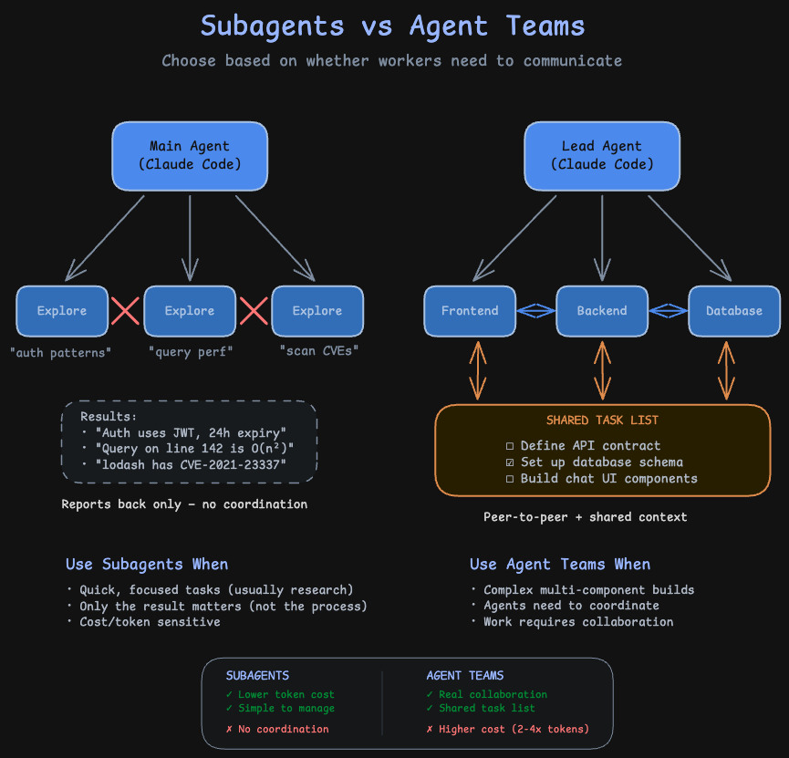

# team vs subagent

Use a subagent when you need a quick, focused worker: research a question, verify a claim, review a file. The subagent does the work and returns a summary. Your main conversation stays clean.Use an agent team when teammates need to share findings, challenge each other, and coordinate independently. Agent teams are best for research with competing hypotheses, parallel code review, and new feature development where each teammate owns a separate piece.

### Subagents vs Agent Teams

| Aspect | Subagents | Agent Teams |
|--------|-----------|-------------|
| **Delegation model** | Parent delegates subtask, waits for result | Team lead assigns work, teammates execute independently |
| **Context** | Fresh context per subtask, results distilled back | Each teammate maintains its own persistent context |
| **Coordination** | Sequential or parallel, managed by parent | Shared task list with automatic dependency management |
| **Communication** | Return values only | Inter-agent messaging via mailbox |
| **Session resumption** | Supported | Not supported with in-process teammates |
| **Best for** | Focused, well-defined subtasks | Large multi-file projects requiring parallel work |

