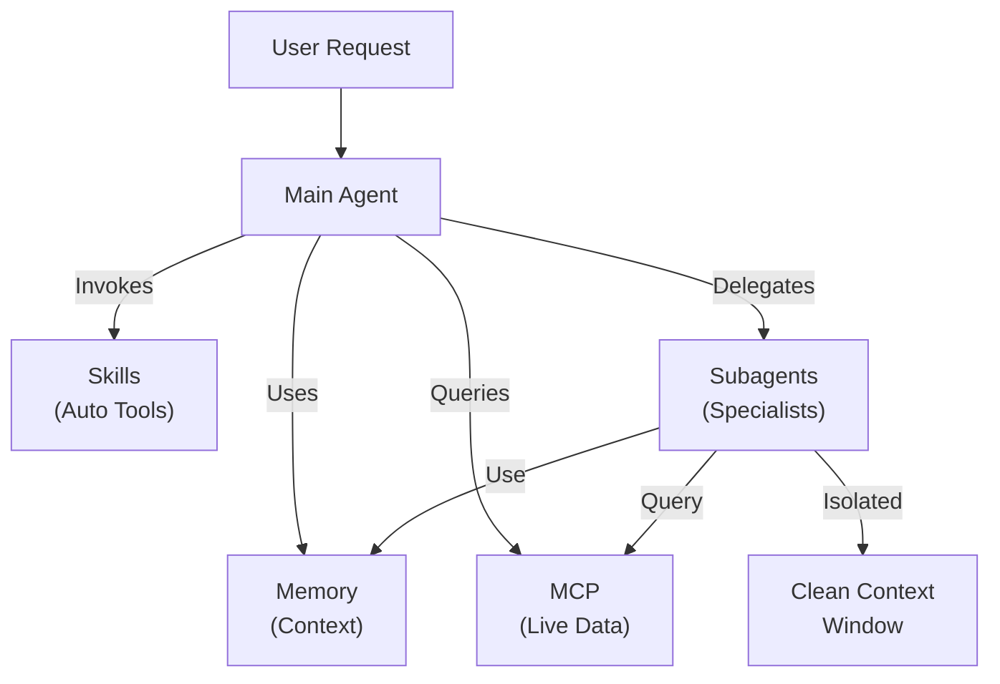

# concepts

# Integration Pattern

```mermaid
graph TD
    User["User Request"] --> Main["Main Agent"]
    Main -->|Uses| Memory["Memory<br/>(Context)"]
    Main -->|Queries| MCP["MCP<br/>(Live Data)"]
    Main -->|Invokes| Skills["Skills<br/>(Auto Tools)"]
    Main -->|Delegates| Subagents["Subagents<br/>(Specialists)"]

    Subagents -->|Use| Memory
    Subagents -->|Query| MCP
    Subagents -->|Isolated| Context["Clean Context<br/>Window"]
```

