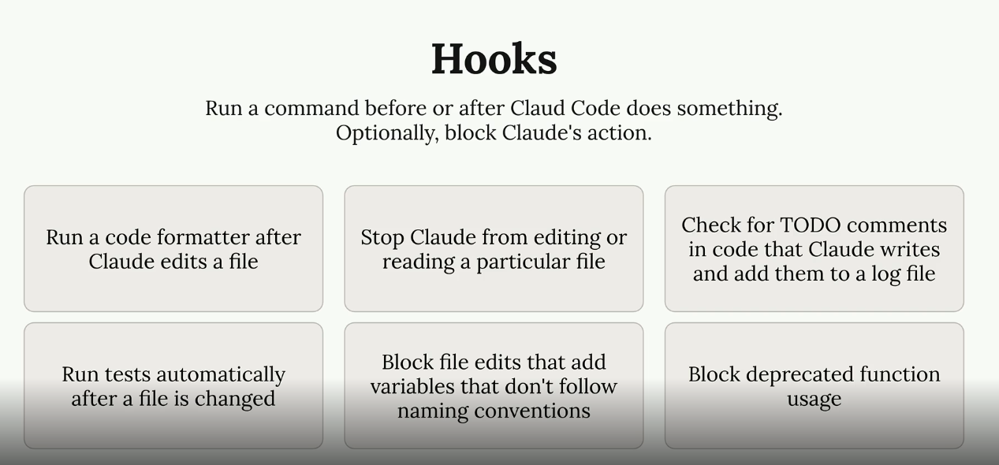
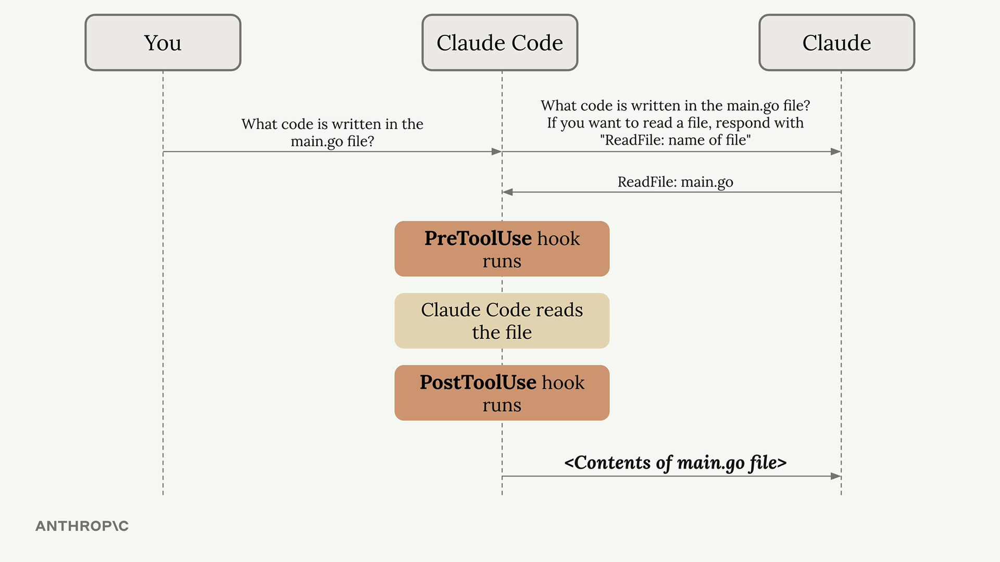
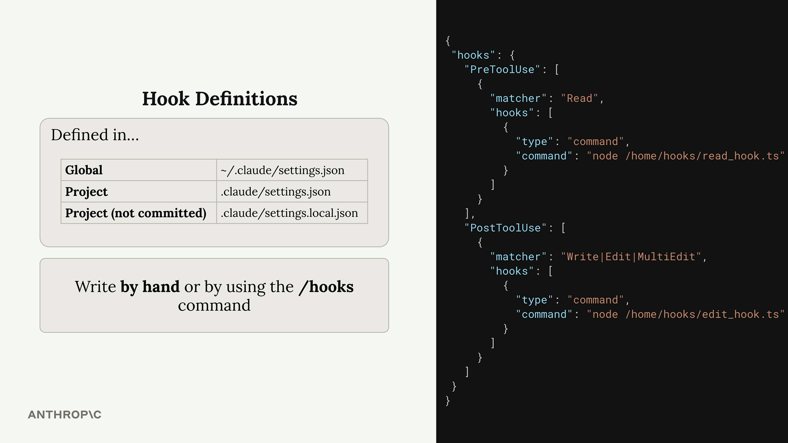
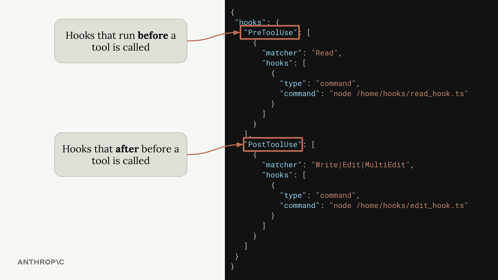
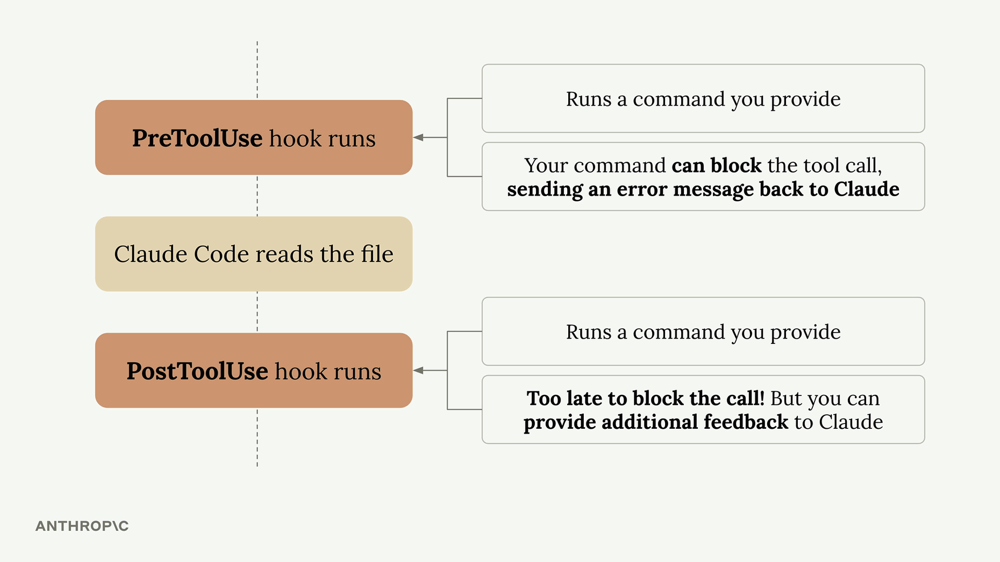

# Hooks

hooks scope and types

## applications

common ways to use hooks:

    Code formatting - Automatically format files after Claude edits them
    Testing - Run tests automatically when files are changed
    Access control - Block Claude from reading or editing specific files
    Code quality - Run linters or type checkers and provide feedback to Claude
    Logging - Track what files Claude accesses or modifies
    Validation - Check naming conventions or coding standards

## define

    Global - ~/.claude/settings.json (affects all projects)
    Project - .claude/settings.json (shared with team)
    Project (not committed) - .claude/settings.local.json (personal settings)

