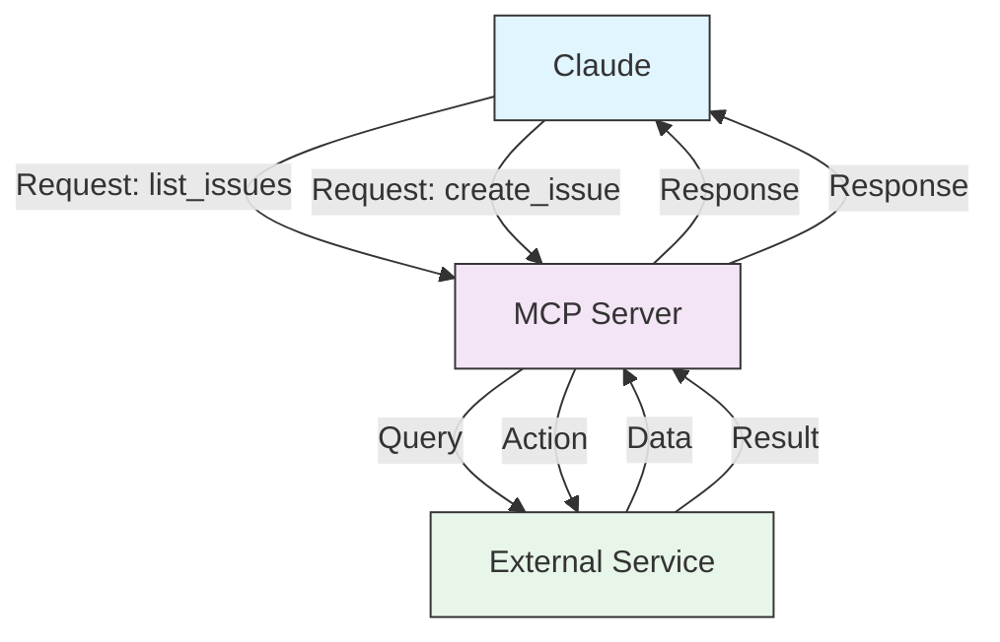
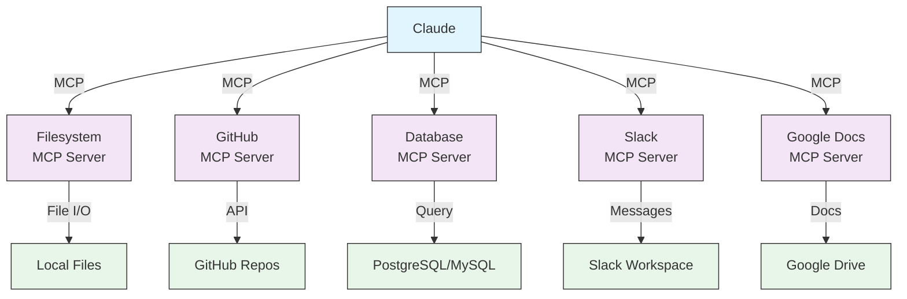

# mcp Servers


## MCP Architecture



## MCP Ecosystem



### Adding MCP Servers

```bash
# Add HTTP-based server
claude mcp add --transport http github https://api.github.com/mcp

# Add local stdio server
claude mcp add --transport stdio database -- npx @company/db-server

# List all MCP servers
claude mcp list

# Get details on specific server
claude mcp get github

# Remove an MCP server
claude mcp remove github

# Reset project-specific approval choices
claude mcp reset-project-choices

# Import from Claude Desktop
claude mcp add-from-claude-desktop
```

## Available MCP Servers Table

| MCP Server | Purpose | Common Tools | Auth | Real-time |
|------------|---------|--------------|------|-----------|
| **Filesystem** | File operations | read, write, delete | OS permissions | ✅ Yes |
| **GitHub** | Repository management | list_prs, create_issue, push | OAuth | ✅ Yes |
| **Slack** | Team communication | send_message, list_channels | Token | ✅ Yes |
| **Database** | SQL queries | query, insert, update | Credentials | ✅ Yes |
| **Google Docs** | Document access | read, write, share | OAuth | ✅ Yes |
| **Asana** | Project management | create_task, update_status | API Key | ✅ Yes |
| **Stripe** | Payment data | list_charges, create_invoice | API Key | ✅ Yes |
| **Memory** | Persistent memory | store, retrieve, delete | Local | ❌ No |
