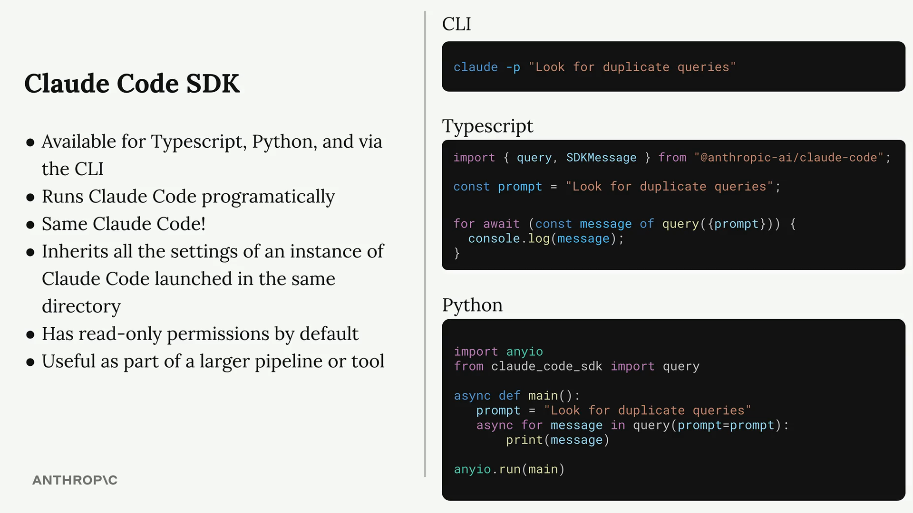

# SDK



## read only default mode:

```
import { query } from "@anthropic-ai/claude-code";

const prompt = "Look for duplicate queries in the ./src/queries dir";

for await (const message of query({
  prompt,
})) {
  console.log(JSON.stringify(message, null, 2));
}

```

## enable tools

```

for await (const message of query({
  prompt,
  options: {
    allowedTools: ["Edit"]
  }
})) {
  console.log(JSON.stringify(message, null, 2));
}
```