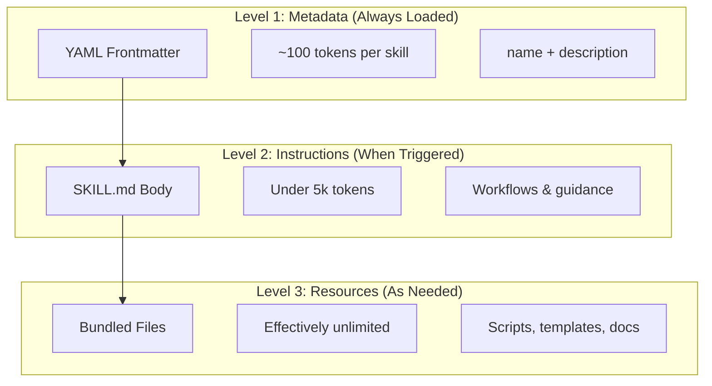

# skills

Agent Skills are reusable, filesystem-based capabilities that extend Claude's functionality. They package domain-specific expertise, workflows, and best practices into discoverable components that Claude automatically uses when relevant.

Agent Skills are modular capabilities that transform general-purpose agents into specialists

    Specialize Claude: Tailor capabilities for domain-specific tasks
    Reduce repetition: Create once, use automatically across conversations
    Compose capabilities: Combine Skills to build complex workflows
    Scale workflows: Reuse skills across multiple projects and teams
    Maintain quality: Embed best practices directly into your workflow

* [open standard](https://agentskills.io/home)
* [10 lessons session about skills](https://github.com/luongnv89/claude-howto/blob/main/03-skills/README.md)

## Progressive Disclosure

Skills leverage a progressive disclosure architecture—Claude loads information in stages as needed, rather than consuming context upfront.

## Skill loading hierarchy

| Type | Location | Scope | Shared | Best For |
|------|----------|-------|--------|----------|
| **Enterprise** | Managed settings | All org users | Yes | Organization-wide standards |
| **Personal** | `~/.claude/skills/<skill-name>/SKILL.md` | Individual | No | Personal workflows |
| **Project** | `.claude/skills/<skill-name>/SKILL.md` | Team | Yes (via git) | Team standards |
| **Plugin** | `<plugin>/skills/<skill-name>/SKILL.md` | Where enabled | Depends | Bundled with plugins |

When skills share the same name across levels, higher-priority locations win: **enterprise > personal > project**. Plugin skills use a `plugin-name:skill-name` namespace, so they cannot conflict.

## subagent execution

## dynamic context injection