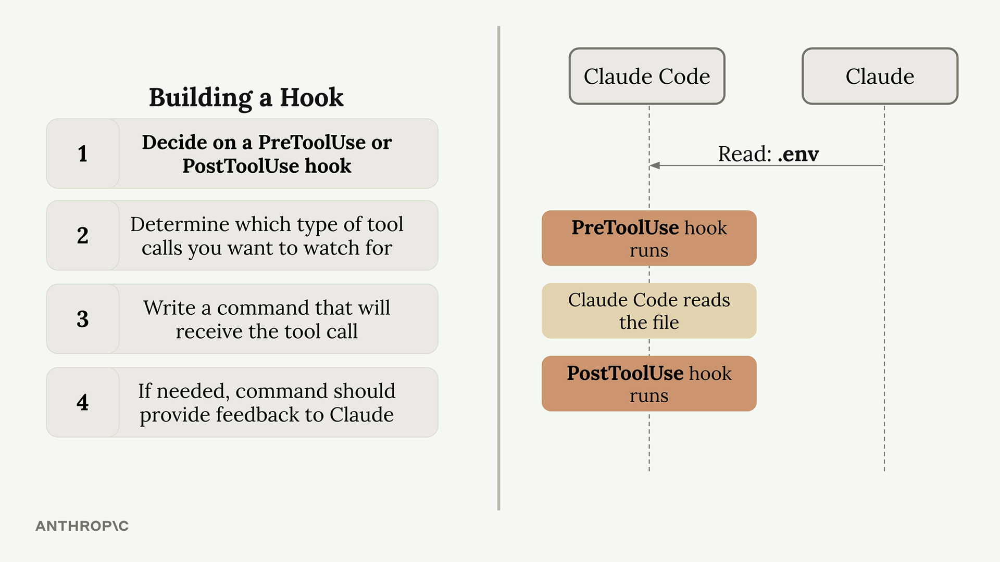
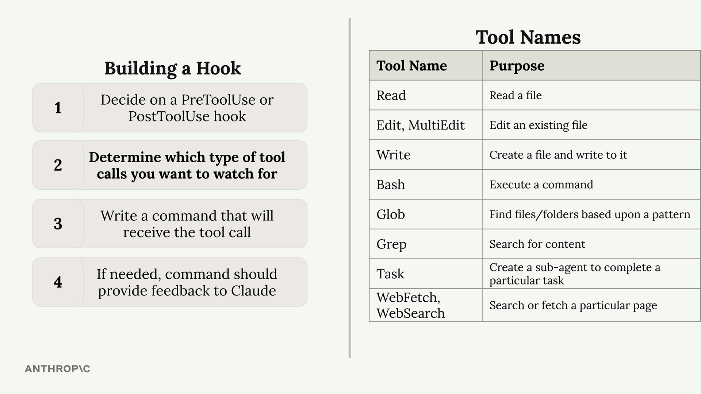
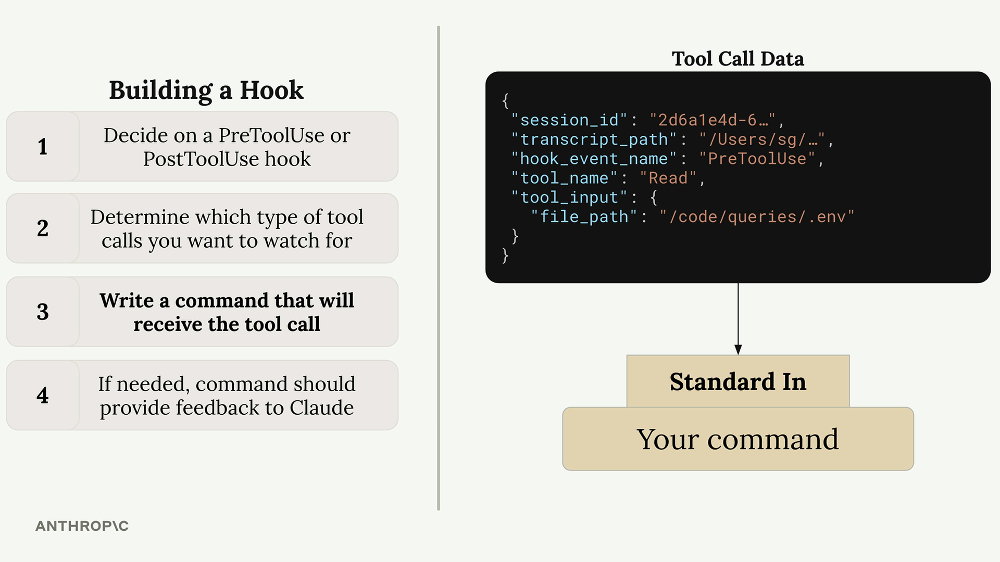
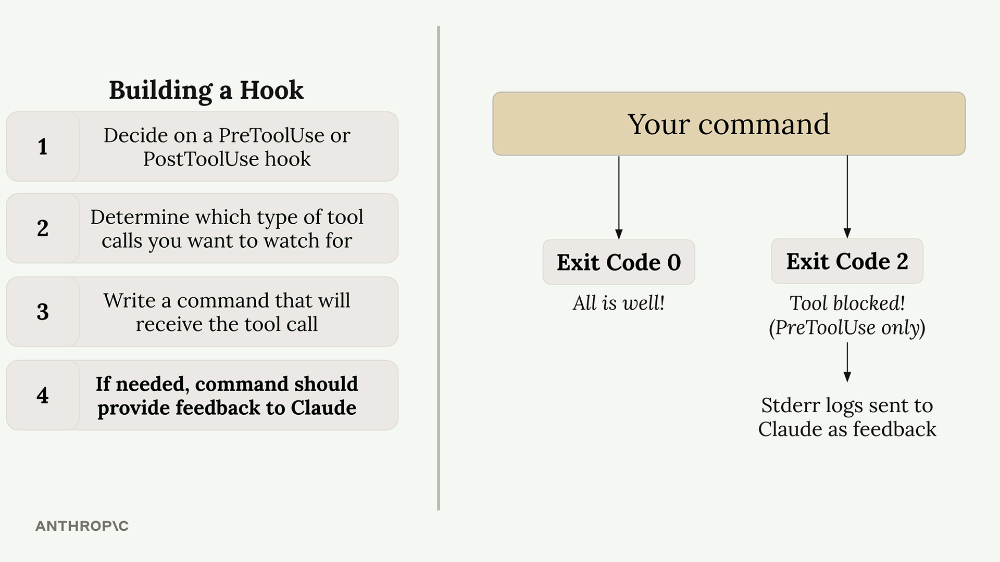

# lab hooks

https://cc.sj-cdn.net/instructor/4hdejjwplbrm-anthropic/assets/1759518550/queries.zip

* objective: prevent claude to read .env

## Building a Hook


## Available Tools


* or // ask directly
```
> list out name of all tools you have access to 

```

## write command



## custom command



 * Exit Code 0 - Everything is fine, allow the tool call to proceed
* Exit Code 2 - Block the tool call (PreToolUse hooks only)

## implement examples

```
"matcher": "Read|Grep"
"command": "node ./hooks/read_hook.js"
```

```
read_hook.js
============

async function main() {
  const chunks = [];
  for await (const chunk of process.stdin) {
    chunks.push(chunk);
  }
  
  const toolArgs = JSON.parse(Buffer.concat(chunks).toString());
  
  // Extract the file path Claude is trying to read
  const readPath = 
    toolArgs.tool_input?.file_path || toolArgs.tool_input?.path || "";
  
  // Check if Claude is trying to read the .env file
  if (readPath.includes('.env')) {
    console.error("You cannot read the .env file");
    process.exit(2);
  }
}


```